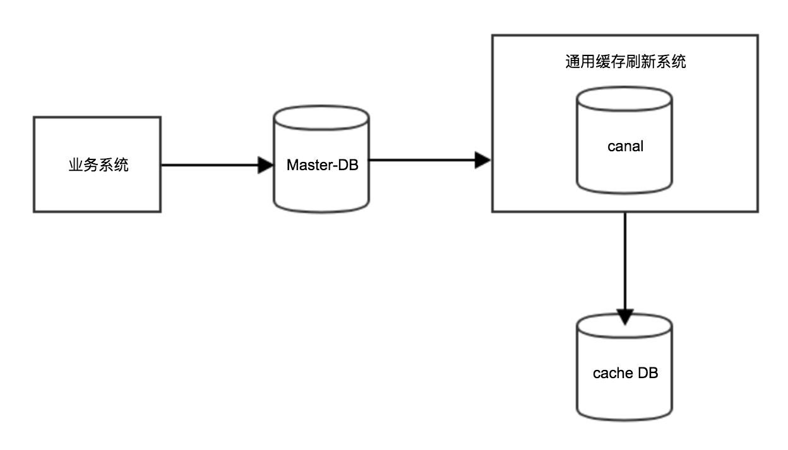

# 背景
大型Web项目肯定少不了缓存（系统缓存），生成缓存有很多种方式，也各有各缺点和优点。
## 同步生成缓存
这种机制的实现方式是在业务代码里加上回调，在回调里生成缓存，但是这种方式有以下缺点。
1. 耦合性高：写缓存的代码和业务代码耦合到了一起，如果缓存写失败或者抛出异常，直接影响业务代码。
2. 拖慢业务系统：写缓存肯定是要占用CPU和资源的，写一个或者两个缓存还好，如果有上千个，每个10ms，那就是10m，任何系统的响应超过10m，如果访问量一升高，系统就等着崩溃吧。

## 异步生成缓存
通过定时任务定时刷新缓存，可以使用独立的项目来生成缓存，虽然这种方式让生成缓存的代码和业务代码解耦出来，但是也有缺点。
1. 缓存延迟:很多业务场景下缓存延迟是不允许的，比如支付下单等。
2. 缓存未变更时也会刷新缓存: 因为是异步刷新，刷新逻辑无法得知缓存是否该被刷新，所以会把所有缓存都进行刷新，占用资源并且对缓存的存储造成一定的压力。

那么，有其他既能和业务代码完全隔离开，又能做到几乎无延迟的实时性的方案么？

# 项目介绍
通用缓存刷新系统是基于[canal](https://github.com/alibaba/canal)的无延迟(接近无延迟)的刷新系统。

设计到的技术如下:
1. [canal](https://github.com/alibaba/canal)。
2. [kafka](http://kafka.apache.org/)。
3. java8。
4. Spring等等。

# wiki文档
[wiki地址](https://github.com/feigeswjtu/CommonCacheSyncSystem/wiki)

